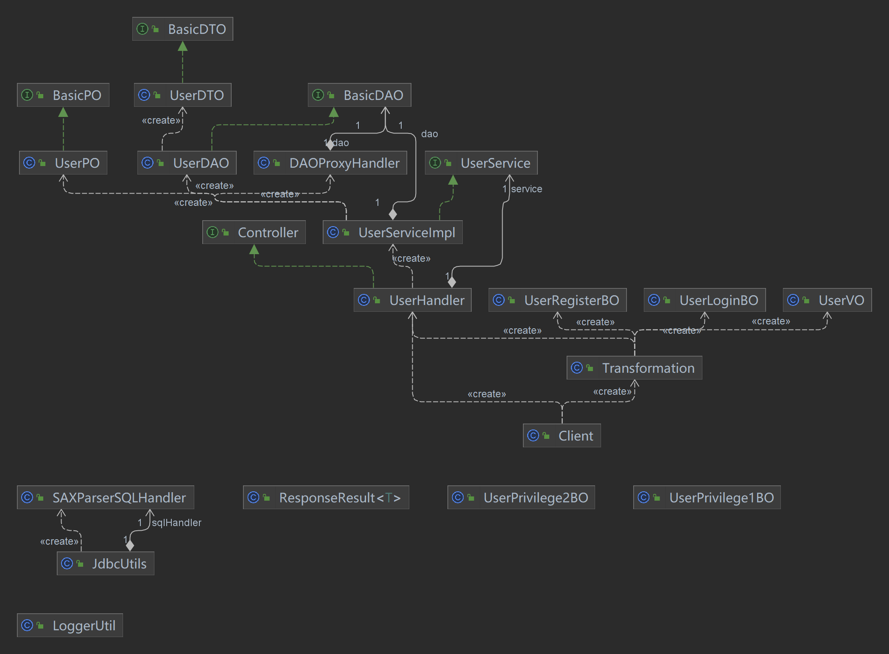

关于这个框架的搭建，大部分都借鉴了MVC三层框架DEMO。

1. util包下的工具类都是日志Logger

2. pojo

    1. po下的user中的privilege是借鉴了DEMO中CommonResult中的静态内部类
    2. bo的实现也是通过对DEMO的剖析有了更深的理解才写出来的
    3. 我将dto视为DEMO中的vo
    4. 我将vo放在view层来理解

    前端后台之间的传输数据也并不是那么死板，而是针对要什么就实例化对应的pojo。

    所以才有前端后台都可以实例化bo，因为bo都属于它们的业务，也可以说是正因要完成bo这个业务，所以前端后台才能联系在一起。

3. service层、controller层、bo实体以及view层之间的关系大部分都是靠DEMO来理清晰的。

4. 我将Controller抽离出来成为一个规范的接口，用UserHandler来处理User的业务。

    但是有一个问题就是我的Controller接口并未声明任何方法。也就是说要在前端符合DIP情况来调用时，要通过向下转型才能真正的使用UserHandler。

5. DEMO中的CommonResult我将其变为controller层下的一个工具类，ResponseResult类，该类用于将服务端的各种数据传输给前端。

6. 对应的我也假设在view也存在一个传输数据的层级。我将其简易的用Transformation来代替它。在这个类内部将客户端的请求转换成数据向下传递给Controller

各实现具体细节在源码中有注释说明

# 关于UserPO

权限静态内部类向外开放，似乎破坏了封装性。

但是又觉得需要定义一个统一的权限标准。而且觉得放在UserPO内部更好管理。

# 关于UserDAO

要依赖DAOProxyHandler、UserServiceImpl、JdbcUtils才能工作。

1. 关于JDBC的三个字段Connection、PreparedStatement、ResultSet，第一个需要依赖DAOProxyHandler来开启，第二、三个需要依赖代理来关闭。
2. 因为在UserDAO内的成员属性xml，是需要UserServiceImpl中通过特定服务传入不同的xml文件来得到的。
3. 查询的过滤条件也是依赖UserServiceImpl传进来的。
4. 传进来的xml文件是通过JdbcUtils来解析出sql语句的。（静态的工具方法应该不违反迪米特原则吧）

# 关于DAOProxyHandler

要依赖具体的DAO实体，以及JdbcUtils来工作

1. 有了DAO实体的被代理类，该代理人才能工作
2. 要通过JdbcUtils来帮助DAO实体连接与关闭数据库

# 关于UserServiceImpl

要依赖DAOProxyHandler、各BO实体、UserPO实体来工作

1. 通过代理DAO类才能操作数据库，完成业务
2. BO实体作为上级传进来的一些业务信息
3. 有一些PO实体是在方法内创建的。（是不是违反了迪米特原则？）

# 关于前后交互

## 关于DTO

是不是前端也可以用这个实体，将前端数据传给后台

## 关于ResponseResult

这个是不是也可以用于将前端的数据传给后台

# 目前框架关系

